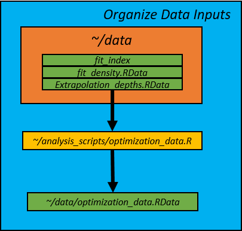
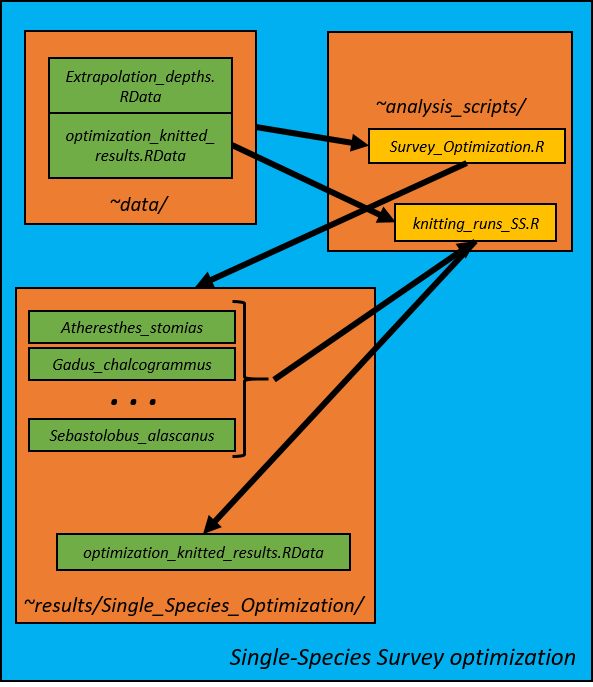

# Multispecies Stratified Survey Optimization for Gulf of Alaska Groundfishes
 
This repository is provides the code used for an In Prep NOAA Technical 
Memorandum manuscript by Zack Oyafuso, Lewis Barnett, Margaret Siple,
and Stan Kotwicki temporarily entitled "The expected performance and 
feasibility of a Gulf of Alaska groundfish bottom trawl survey optimized 
for abundance estimation." 

## Package Requirements

A handful of R packages are required. R version 4.0.3 (2020-10-10)
was used for the analysis. Some conventional packages for plotting
and manipulating data:

```
library(tidyverse)
library(sp)
library(raster)
library(RColorBrewer)
```

The bulk of the optimization is done within the SamplingStrata R Package 
(https://github.com/barcaroli/SamplingStrata). There is one function in 
the package, BuildStrataDF() that I modify for this analysis, so it is 
best to use a forked version of the package that I modified:

```
library(devtools)
devtools::install_github(repo = "zoyafuso-NOAA/SamplingStrata")
library(SamplingStrata)
```

Lastly, the TSP package was imported to calculate the shortest path
that visits each station.

```
library(TSP)
```

## Species Included

The species set included in the survey optimization is a complex of fifteen 
Gulf of Alaska cods, flatfishes, and rockfishes:

| Scientific Name                     | Common Name                           |
|-------------------------------------|---------------------------------------|
| *Gadus chalcogrammus*               | Alaska or walleye pollock             | 
| *Gadus macrocephalus*               | Pacific cod                           |   
| *Atheresthes stomias*               | arrowtooth flounder                   | 
| *Hippoglossoides elassodon*         | flathead sole                         |
| *Glyptocephalus zachirus*           | rex sole                              | 
| *Lepidopsetta polyxystra*           | northern rock sole                    |
| *Lepidopsetta bilineata*            | southern rock sole                    | 
| *Microstomus pacificus*             | Dover sole                            | 
| *Hippoglossus stenolepis*           | Pacific halibut                       |
| *Sebastes alutus*                   | Pacific ocean perch                   |
| *Sebastes melanostictus/aleutianus* | blackspotted and rougheye rockfishes* |
| *Sebastes brevispinis*              | silvergrey rockfish                   |
| *Sebastes variabilis*               | dusky rockfish                        |
| *Sebastes polyspinis*               | northern rockfish                     |
| *Sebastolobus alascanus*            | shortspine thornyhead                 |

*Due to identification issues between two rockfishes these two species were 
combined into a species group we will refer as "BE and RS rockfishes"
(blackspotted rockfish and rougheye rockfish, respectively). 

In addtion, eleven species/species groups were included in the survey evaluations.
These taxa were not included in the optimization but included when simulating
surveys:

| Scientific Name                     | Common Name                           |
|-------------------------------------|---------------------------------------|
| *Anoplopoma fimbria*                | sablefish                             |
| *Pleurogrammus monopterygius*       | Atka mackerel                         |
| *Sebastes borealis*                 | shortraker rockfish                   |
| *Sebastes variegatus*               | harlequin rockfish                    |
| *Sebastes ruberrimus*               | yelloweye rockfish                    |
| Species from Genera *Hemitripterus*, *Hemilepidotus*, and *Myoxocephalus* | sculpins (plain, great, and bigmouth  sculpins and yellow Irish lord) |
| *Beringraja binoculata*             | big skate                             |
| *Raja rhina*                        | longnose skate                        |
| *Albatrossia Pectoralis*            | giant grenadier                       |
| *Enteroctopus dofleini*             | giant octopus                         |
| *Squalus suckleyi*                  | Pacific spiny dogfish                 |

## Input Data -- Spatial Domain

The spatial domain of the survey optimization is the Gulf of Alaska 
divided into a 2 nautical mile (~3.7 km) resolution grid resulting in 
`n_cells` = 22832 total survey cells. The script used to create the 
survey grid is contained in the [MS_OM_GoA](https://github.com/zoyafuso-NOAA/MS_OM_GoA/blob/master/data/Extrapolation_Grid_Covariates.R)
repo. That script produces an .RData file called 
Extrapolation_depths.RData that is contained within the 
[data/](https://github.com/zoyafuso-NOAA/Optimal_Allocation_GoA/tree/master/data) 
directory in this repo. Extrapolation_depths.RData contains a variable 
called `Extrapolation_depths` which is a dataframe of `n_cells` rows. 
Useful fields in `Extrapolation_depths` for this analysis are listed 
below along with the spatial footprint of the survey area:

| Field Name          | Description                                 |
|---------------------|---------------------------------------------|
| Area_km2            | num, Area of grid cell in square kilometers |
| Lon                 | num, Longitude                              |
| Lat                 | num, Latitude                               |
| Depth_EFH           | num, Depth in meters                        |
| E_km                | num, Eastings in kilometers, 5N UTM         |
| N_km                | num, Northings in kilometers, 5N UTM        |
| stratum             | int, Stratum ID in current STRS design      |


## Input Data -- Predicted denisity
Density of each species was predicted across the spatiotemporal domain using a 
vector autoregressive spatiotemporal model using the [VAST package](https://github.com/James-Thorson-NOAA/VAST).
Gulf of Alaska bottom-trawl catch-per-unit area survey data from years
1996, 1999, and the odd years from 2003-2019 (`n_years` = 11 total 
observed survey years) were used in the model fitting. Code in the 
Z. Oyafuso's [zoyafuso-NOAA/MS_OM_GoA/](https://github.com/zoyafuso-NOAA/MS_OM_GoA) 
repo was used to run the VAST models and the output was saved in this
repo ([data/](https://github.com/zoyafuso-NOAA/MS_OM_GoA/blob/master/data/Extrapolation_Grid_Covariates.R)fit_density.RData). 
This .RData file contains a variable called "D_gct" which is a 3-D array 
of dimension (`n_cells`, `ns_all`, `n_years`) of predicted densities. 

## Script Overview (Optimal_Allocation_GoA/analysis_scripts/)

The survey optimization framework is modularized into separate scripts. These
are the scripts used below and the sections following are the order in which
the optimization is conducted. As of now, there are no high-level wrapper
functions that may ease wider general use. 

[optimization_data.R](https://github.com/zoyafuso-NOAA/Optimal_Allocation_GoA/blob/master/analysis_scripts/optimization_data.R):
Synthesizes data inputs and constants common to all subsequent scripts. 

[Survey_Optimization_SS.R](https://github.com/zoyafuso-NOAA/Optimal_Allocation_GoA/blob/master/analysis_scripts/Survey_Optimization_SS.R):
Conducts single-species survey optimization.

[knitting_runs_SS.R](https://github.com/zoyafuso-NOAA/Optimal_Allocation_GoA/blob/master/analysis_scripts/knitting_runs_SS.R):
Knits all the single-species optimization runs into neat result outputs.

[Survey_Optimization.R](https://github.com/zoyafuso-NOAA/Optimal_Allocation_GoA/blob/master/analysis_scripts/Survey_Optimization.R):
Conducts the multispecies survey optimization.

[knitting_runs.R](https://github.com/zoyafuso-NOAA/Optimal_Allocation_GoA/blob/master/analysis_scripts/knitting_runs.R): 
Knits all the multispecies optimization runs into neat result outputs.

[Simulate_Surveys.R](https://github.com/zoyafuso-NOAA/Optimal_Allocation_GoA/blob/master/analysis_scripts/Simulate_Surveys.R):
Simulates current and optimized stratified random surveys.

[survey_distance_travelled/haul_data.R](https://github.com/zoyafuso-NOAA/Optimal_Allocation_GoA/blob/master/analysis_scripts/survey_distance_travelled/haul_data.R): 
Synthesizes haul-level historical data

[survey_distance_travelled/historical_surveys.R](https://github.com/zoyafuso-NOAA/Optimal_Allocation_GoA/blob/master/analysis_scripts/survey_distance_travelled/historical_surveys.R): 
Calculates actual distance travelled and the approximate shortest 
total distance using the TSP package for the historically observed
stations for each survey year. The nearest and second closest stations 
are also calculated.

[survey_distance_travelled/survey_feasibility.R](https://github.com/zoyafuso-NOAA/Optimal_Allocation_GoA/blob/master/analysis_scripts/survey_distance_travelled/survey_feasibility.R): 
Simulates station locations under the current and optimized STRS designs
and calculates the approximate shortest total distance using the TSP package.

## 1. Input Data and constants [(optimization_data.R)](https://github.com/zoyafuso-NOAA/Optimal_Allocation_GoA/blob/master/analysis_scripts/optimization_data.R)

https://user-images.githubusercontent.com/60302777/120702226-afcca780-c468-11eb-9ae3-9de8bd1cecd6.mp4

Data for the optimization were synthesized in the optimization_data.R script. 
It's purpose is to take the VAST model density predictions and create an input 
dataset in the form that is used in the SamplingStrata package. The depth and 
E_km fields are used as strata variables. The script creates an .RData file 
called optimization_data.RData is saved in the [data/](https://github.com/zoyafuso-NOAA/Optimal_Allocation_GoA/tree/master/data)  
directory. Many of the constants used throughout the subsequent scripts are
also assigned here. The output of this script is an RData file called
[optimization_data.RData](https://github.com/zoyafuso-NOAA/Optimal_Allocation_GoA/blob/master/data/optimization_data.RData)
and contains the following variables and constants: 

| Variable Name     | Description                                                                                                                         | Class Type and Dimensions                  |
|-------------------|-------------------------------------------------------------------------------------------------------------------------------------|--------------------------------------------|
| `ns_opt`              | Number of species included in optimization                                                                                          | numeric vector, length 1                   |
| `ns_eval`             | Number of species excluded in optimization                                                                                          | numeric vector, length 1                   |
| `ns_all`              | sum of `ns_opt` and `ns_eval`                                                                                                           | numeric vector, length 1                   |
| `common_names_opt`    | Common names of species included in optimization                                                                                    | character vector, length `ns_opt`            |
| `common_names_eval`   | Common names of species excluded in optimization (periods removed for path name purposes)                                                          | character vector, length `ns_eval`           |
| `common_names_all`    | Common names of all species considered                                                                                              | character vector, length `ns_all`            |
| `spp_idx_opt`         | indices of the order of species included in optimization according to the order of the species names in common_names_all            | numeric vector, length `ns_opt`              |
| `spp_idx_eval`        | indices of the order of species excluded in optimization according to the order of the species names in common_names_all            | numeric vector, length `ns_eval`             |
| `n_boats`             | Total number of sample sizes of interest, (`n_boats` = 3)                                                                              | numeric vector, length 1                   |
| `samples`             | Range of sample sizes of interest, corresponding to 1 (n = 292), 2 (n = 550), and 3 (n = 825) boats                                 | numeric vector, length `n_boats`              |
| `n_cells`             | Total number of grid cells in the spatial domain, (`n_cells` = 23339 cells)                                                                 | numeric vector, length 1                   |
| `n_years`             | Total number of years with data, (`n_years` = 11 years between 1996-2019)                                                               | numeric vector, length 1                   |
| `year_set`            | Sequence of years over the temporal domain (1996 - 2019)                                                                            | numeric vector, length 24                  |
| `years_included`      | Indices of years with data                                                                                                          | numeric vector, length `n_years`               |
| `n_districts`      | Total number of Gulf of Alaska FMP management districts (5)                                                                               | numeric vector, length 1                   |
| `districts`           | names of the five (5) Gulf of Alaska FMP management districts with W and E boundaries                                                                  | dataframe, nrow = `n_districts` |
| `district_vals`       | district index for each cell in the spatial domain                                                                                     | numeric vector, length `n_cells` |
| `inpfc_vals_current`   | International North Pacific Fisheries Commission (INPFC) statistical areas index for each cell in the spatial domain                  | numeric vector, length `n_cells` |
| `n_iters`             | Total number of times a survey is simulated, (`n_iters` = 1000)                                                                        | numeric vector, length 1                   |
| `true_mean`           | True mean densities for each species and year. This is the "truth" that is used in the performance metrics when simulating surveys  | numeric matrix, `ns_all` rows, `n_years` columns |
| `true_index`          | True abundance index for each species and year. This is the "truth" that is used in the performance metrics when simulating surveys | numeric matrix, `ns_all` rows, `n_years` columns |
| `true_index_district` | True abundance index for each species and year for each management district. This is the "truth" that is used in the performance metrics when simulating surveys | numeric array, dimensions: `ns_all`, `n_years`, `n_districts` |

`frame_all` and `frame_district` is the main data input used in the gulf-wide
and district-level optimizations, respectively. Both dataframes had`n_cells`
rows with useful fields:

| Field Name           | Description                                                                                                                                         |
|----------------------|-----------------------------------------------------------------------------------------------------------------------------------------------------|
| domainvalue          | management district id (1, 2, ..., `n_districts` for frame_district or 1 for frame_all)                                                             |
| id                   | unique ID for each sampling cell                                                                                                                    |
| X1                   | strata variable 1: longitude in eastings (km). Because the optimization does not read in negative values, the values are scaled so that the lowest value is 0 |
| X2                   | strata variable 2: depth of cell (m)                                                                                                                |
| WEIGHT               | number of observed years                                                                                                                            |
| Y1, Y2, ...          | density for a given cell summed across observed years for  each species                                                                             |
| Y1_SQ_SUM, Y2_SQ_SUM | density-squared for a given cell, summed across observed  years for each species  |



## 2. Survey Optimization--Single Species Optimizations [(Survey_Optimization_SS.R)](https://github.com/zoyafuso-NOAA/Optimal_Allocation_GoA/blob/master/analysis_scripts/Survey_Optimization_SS.R)

Gulf-wide and district-level single-species optimizations are first conducted.
Ten strata are used for the gulf-wide optimization and five strata per distict 
are used for the district-level optimization. Optimized single-species CVs are 
used as the lower limit for the subsequent multispecies survey optimizations,
so we need to conduct these single-species analyses first. 
Optimizations were conducted at each boat effort level (../boat1, ../boat2,
../boat3). Each run of the optimization is saved in its own directory, which
contains teh following files:

| File Name                  | Description                                                         |
|----------------------------|---------------------------------------------------------------------|
| output/plotdom1.png        | Genetic algorithm results                                           |
| output/outstrata.txt       | Stratum-level means and variances for each species                  |
| solution.png               | Low-quality snapshot of the solution mapped onto the spatial domain |
| solution_with_stations.png | Low-quality snapshot of the solution mapped onto the spatial domain with simulated locations of stations |
| result_list.RData          | Result workspace of the optimization                                |

The result_list.RData workspace contains a named list called `result_list`, 
which consists of the relevant elements:

| Variable Name                | Description                                    | Class Type and Dimensions                                            |
|------------------------------|------------------------------------------------|----------------------------------------------------------------------|
| `result_list$CV_constraints` | expected CV across species                     | numeric vector, length `ns_opt` if multispecies, 1 if single species |
| `result_list$n`              | optimized total sample size                    | numeric, length 1                                                    |
| `result_list$sol_by_cell`    | stratum id for each cell in the spatial domain | numeric, length 1                                                    |

`result_list$sum_stats` is a dataframe contains important 
stratum-specific characteristics of the optimized solution:
| Field Name                      | Description                                                               |
|---------------------------------|---------------------------------------------------------------------------|
| stratum_id                      | unique integer stratum id                                                 | 
| Domain                          | distict integer id (1 if gulf-wide solution)                              |
| Stratum                         | stratum number within Domain id (not to be confused with stratum_id)      |
| Population                      | total number of sampling units                                            | 
| Allocation                      | total number of stations allocated (`round(result_list$sum_stats$SOLUZ)`) | 
| SOLUZ                           | original solution allocation from Bethel algorithm                        | 
| wh                              | sampling rate (Allocation / Population)                                   | 
| Wh                              | stratum weight (Population / `n_cells`)                                   |
| Lower_X1                        | lower longitude (scaled E_km) bound                                       | 
| Upper_X1                        | upper longitude (scaled E_km) bound                                       | 
| Lower_X2                        | lower depth (m) bound                                                     | 
| Upper_X2                        | upper depth (m) bound                                                     | 

`result_list$solution$aggr_strata` is a similar dataframe that contains 
stratum-specific means and variances for each species included in the 
optimization.

## 3. Knit Single-Species Optimization Results [(knitting_runs_SS.R)](https://github.com/zoyafuso-NOAA/Optimal_Allocation_GoA/blob/master/analysis_scripts/knitting_runs_SS.R)

The results from each run are synthesized in the knitting_runs_SS.R script. 
Solutions that correspond to the three boat-effort levels were 
filtered and are knitted together into result objects. Four variables are 
saved in the [gulf-wide optimization_knitted_results.RData](https://github.com/zoyafuso-NOAA/Optimal_Allocation_GoA/blob/master/results/full_domain/Single_Species_Optimization/optimization_knitted_results.RData) 
workspace:

| Variable Name       | Description                                                                 | Class Type and Dimensions                                            |
|---------------------|-----------------------------------------------------------------------------|----------------------------------------------------------------------|
| `settings`          | cvs and sammple sizes across domains/gulf for each boat effort and species  | dataframe, `ns_all` * `n_boats` rows, 5 columns                      |
| `res_df`            | stratum id for each cell in the domain                                      | dataframe, `n_cells` rows, `ns_all` * `n_boats` columns              |
| `strata_list`       | Collection of `result_list$solution$aggr_strata` from each run              | list of length   `ns_all` * `n_boats`                                |
| `strata_stats_list` | Collection of stratum-level means and variances across species for each run | list of length `ns_all` * `n_boats`                                  |



## 4. Survey Optimization--Multi-Species Optimizations [(Survey_Optimization.R)](https://github.com/zoyafuso-NOAA/Optimal_Allocation_GoA/blob/master/analysis_scripts/Survey_Optimization.R)
Multispecies optimizations are conducted with 10, 15, and 20 strata for the 
gulf-wide optimization and 3, 5, and 10 strata per district for the district-
level optimizations. Optimizations were conducted for at boat effort level 
(../boat1, ../boat2, ../boat3). Each run of the optimization is saved in its 
own directory with the code template of StrXRunY where X is the number of 
strata in the solution and Y is the run number. Within each run folder contains:

## 5. Knit Multispecies Optimization Results [(knitting_runs.R)](https://github.com/zoyafuso-NOAA/Optimal_Allocation_GoA/blob/master/analysis_scripts/knitting_runs.R)

The results from each run are synthesized in the knitting_runs_SS.R script. Four
variables are saved in the [optimization_knitted_results.RData](https://github.com/zoyafuso-NOAA/Optimal_Allocation_GoA/blob/master/results/MS_optimization_knitted_results.RData) workspace:

## 6. Survey Simulation and Performance Metrics [(Simulate_Surveys.R)](https://github.com/zoyafuso-NOAA/Optimal_Allocation_GoA/blob/master/analysis_scripts/Simulate_Surveys.R)
Optimized and current stratified survey designs are simulated on the spatial
domain for each observed year. For a given combination of the optimized 
survey--number of strata and level of optimization (district or gulf-wide)-- 
and the current survey three result objects are saved. The result names are 
long but the codes are generally:

SUR_XXX_YYY_STR_ZZZ_AAA.RData

XXX refers to either the optimized (XXX = opt) or current  (XXX = cur) survey.

YYY refers to whether the optimization was conducted on the gulf-wide scale 
(YYY = full_domain) or separately for each district (YYY = district)

ZZZ refers to how many strata the optimized survey has (10 or 15 total for 
the gulf-wide optimization or 3 or 5 strata per district for the 
district-wide optimization).

AAA refers to the result type. AAA = simulation_result has the true cv and
relative root mean square error of CV associated with the mean density 
estimates. Within this RData file are the following variables:

* `SUR_XXX_YYY_STR_ZZZ_true_cv` and `SUR_XXX_YYY_STR_ZZZ_rrmse_cv` are 4-D
arrays with dimensions (`n_obs_cv`, `n_years`, `ns_all`, `n_boats`). 
These arrays hold the true cv and rrmse of cv for each observation cv 
scenario, year, species, and number of boats. 

* `SUR_XXX_YYY_STR_ZZZ_sim_mean`, `SUR_XXX_YYY_STR_ZZZ_sim_cv`,
`SUR_XXX_YYY_STR_ZZZ_rb_agg`, and `SUR_XXX_YYY_STR_ZZZ_log_rb_agg`,
are 5-D arrays with dimensions (`n_obs_cv`, `n_years`, `ns_all`, `n_boats`,
`n_iters`). These arrays hold the estimated sample means and cvs, relative bias, 
andclog bias ratio for each observation cv scenario, year, species, number of
boats, and survey replicate. Bias estimates are calculated for the 
abundance indices. 

AAA = rb_district has the relative bias of the abundance index. Within this
RData file is the variable `SUR_XXX_YYY_STR_ZZZ_rb_district`, a 5-D array
with dimensions (`n_obs_cv`, `n_years`, `ns_all`, `n_boats`, `n_iters`).

AAA = log_rb_district has the log bias ratio of the abundance index. Within 
this RData file is the variable `SUR_XXX_YYY_STR_ZZZ_log)rb_district`, a 5-D
array with dimensions (`n_obs_cv`, `n_years`, `ns_all`, `n_boats`, `n_iters`).
