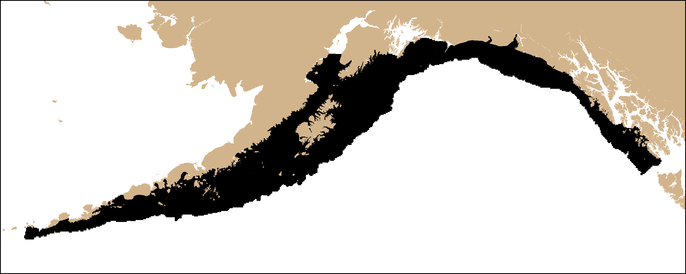

# Multispecies Stratified Survey Optimization for Gulf of Alaska Groundfishes
 
This repository is provides the code used for an In Prep NOAA Technical 
Memorandum manuscript by Zack Oyafuso, Lewis Barnett, Margaret Siple,
and Stan Kotwicki entitled "..." 

## Requirements

A handful of R packages are required. Some conventional ones:

```
library(sp)
library(raster)
library(RColorBrewer)
```

The bulk of the optimization is done within the SamplingStrata R Package 
(https://github.com/barcaroli/SamplingStrata). There is one function in 
the package, BuildStrataDF() that I modify for this analysis, so it is 
best to use a forked version of the package that I modified:

```
library(devtools)
devtools::install_github(repo = "zoyafuso-NOAA/SamplingStrata")
library(SamplingStrata)
```

## Script Overview (Optimal_Allocation_GoA/analysis_scripts/)

optimization_data.R : Synthesizes data inputs and constants common to 
all subsequent scripts. 

Calculate_Population_Variances.R : Calculates population variances of 
simple random, optimized single-species stratified random, and current 
stratified random surveys.

Survey_Optimization.R : Conducts the multi- and single-species survey 
optimization.

knitting_runs.R : knits all the optimization runs into neat result
outputs.

knitting_runs_SS.R : knits all the single-species optimization runs into
neat result outputs.

Simulate_Surveys.R : Simulates current and optimized stratified random 
surveys.

## Species Included

The species set included in the manuscript are a complex of Gulf of Alaska 
cods, flatfishes, and rockfishes. Some species are included in the survey 
optimizations (Optimized = T) while others are excluded but are still included
when simulating surveys (Optimized = F). 

| Scientific Name                     | Common Name                           | Optimized |
|-------------------------------------|---------------------------------------|-----------|
| *Atheresthes stomias*               | arrowtooth flounder                   |     T     |
| *Gadus chalcogrammus*               | Alaska or walleye pollock             |     T     |
| *Gadus macrocephalus*               | Pacific cod                           |     T     |
| *Glyptocephalus zachirus*           | rex sole                              |     T     |
| *Hippoglossoides elassodon*         | flathead sole                         |     T     |
| *Hippoglossus stenolepis*           | Pacific halibut                       |     T     |
| *Lepidopsetta bilineata*            | southern rock sole                    |     T     |
| *Lepidopsetta polyxystra*           | northern rock sole                    |     T     |
| *Microstomus pacificus*             | Pacific Dover sole                    |     T     |
| *Sebastes alutus*                   | Pacific ocean perch                   |     T     |
| *Sebastes melanostictus/aleutianus* | blackspotted and rougheye rockfishes* |     T     |
| *Sebastes brevispinis*              | yellowfin sole                        |     T     |
| *Sebastes polyspinis*               | northern rockfish                     |     T     |
| *Sebastes variabilis*               | dusky rockfish                        |     T     |
| *Sebastolobus alascanus*            | shortspine thornyhead                 |     T     |
| *Anoplopoma fimbria*                | sablefish                             |     F     |
| *Beringraja* spp.                   | skates spp.                           |     F     |
| *Enteroctopus dofleini*             | giant octopus                         |     F     |
| *Pleurogrammus monopterygius*       | Atka mackerel                         |     F     |
| *Sebastes borealis*                 | shortraker rockfish                   |     F     |
| *Sebastes variegatus*               | harlequin rockfish                    |     F     |
| *Squalus suckleyi*                  | spiny dogfish                         |     F     |

*Due to identification issues between two rockfishes these two species were 
combined into a species group we will refer as "Sebastes B_R" (blackspotted 
rockfish and rougheye rockfish, respectively) hereafter. 

## Input Data -- Spatial Domain

The spatial domain of the survey optimization is the Gulf of Alaska 
divided into a roughly 5 km resolution grid resulting in N = 22832 total survey 
cells. The script used to create the survey grid is contained in the [MS_OM_GoA](https://github.com/zoyafuso-NOAA/MS_OM_GoA/blob/master/data/Extrapolation_Grid_Covariates.R)
repo. That script produces an RData product called 
Extrapolation_depths.RData that is contained within the [data/](https://github.com/zoyafuso-NOAA/Optimal_Allocation_GoA/tree/master/data) 
directory in this repo. Extrapolation_depths.RData contains a variable 
called Extrapolation_depths which is a dataframe of N rows. Useful fields for 
this analysis are stated in the table below:

| Field Name          | Description                                 |
|---------------------|---------------------------------------------|
| Area_km2            | num, Area of grid cell in square kilometers |
| Lon                 | num, Longitude                              |
| Lat                 | num, Latitude                               |
| Depth_EFH           | num, Depth in meters                        |
| E_km                | num, Eastings in kilometers, 5N UTM         |
| N_km                | num, Northings in kilometers, 5N UTM        |
| stratum             | int, Stratum ID in current STRS design      |



## Input Data -- Predicted denisity
Density of each species was predicted across the spatiotemporal domain using a 
vector autoregressive spatiotemporal model using the VAST package
(https://github.com/James-Thorson-NOAA/VAST). Gulf of Alaska bottom-trawl 
catch-per-unit area survey data were used from years 1996, 1999, and the odd
years from 2003-2019. Code in the repository zoyafuso-NOAA/MS_OM_GoA/ 
(https://github.com/zoyafuso-NOAA/MS_OM_GoA) was used to run the VAST models 
and the output was saved in this repo (model_11/fit_density.RData). This .RData
file contains a variable called "D_gct" which is a 3-D array of dimension 
(N, ns, 24). There are 24 total years (1996-2019), but only NTime = 11 years of
data used. 

## Input Data -- Putting it all together

Data for the optimization were synthesized in the optimization_data.R script. 
It's purpose is to take the VAST model density predictions and create an input 
dataset in the form that is used in the SamplingStrata package. The depth and 
E_km fields are used as strata variables. The script creates an .RData file 
called optimization_data.RData is saved in the [data/](https://github.com/zoyafuso-NOAA/Optimal_Allocation_GoA/tree/master/data)  
directory. The output of optimization_data.RData contains the following 
variables and constants: 

| Variable Name     | Description                                                                                                                         | Class Type and Dimensions                  |
|-------------------|-------------------------------------------------------------------------------------------------------------------------------------|--------------------------------------------|
| ns_opt            | Number of species included in optimization                                                                                          | numeric vector, length 1                   |
| ns_eval           | Number of species excluded in optimization                                                                                          | numeric vector, length 1                   |
| ns_all            | sum of ns_opt and ns_eval                                                                                                           | numeric vector, length 1                   |
| sci_names_opt     | Scientific names of species included in optimization                                                                                | character vector, length ns_opt            |
| sci_names_eval    | Scientific names of species excluded in optimization                                                                                | character vector, length ns_eval           |
| sci_names_all     | Scientific names of all species considered                                                                                          | character vector, length ns_all            |
| common_names_opt  | Common names of species included in optimization                                                                                    | character vector, length ns_opt            |
| common_names_eval | Common names of species excluded in optimization                                                                                    | character vector, length ns_eval           |
| common_names_all  | Common names of all species considered                                                                                              | character vector, length ns_all            |
| spp_idx_opt       | indices of the order of species included in optimization                                                                            | numeric vector, length ns_opt              |
| spp_idx_eval      | indices of the order of species excluded in optimization                                                                            | numeric vector, length ns_eval             |
| nboats            | Total number of sample sizes of interest, (nboats = 3)                                                                              | numeric vector, length 1                   |
| samples           | Range of sample sizes of interest, corresponding to 1 (n = 280), 2 (n = 550), and 3 (n = 820) boats                                 | numeric vector, length nboats              |
| NStrata           | Total number of strata scenarios, (NStrata = 6)                                                                                     | numeric vector, length 1                   |
| stratas           | Range of number of strata, (stratas = c(5, 10, 15, 20, 30, 60))                                                                     | numeric vector, length NStrata             |
| N                 | Total number of grid cells in the spatial domain, (N = 23339 cells)                                                                 | numeric vector, length 1                   |
| NTime             | Total number of years with data, (NTime = 11 years between 1996-2019)                                                               | numeric vector, length 1                   |
| Year_Set          | Sequence of years over the temporal domain (1996 - 2019)                                                                            | numeric vector, length 24                  |
| Years2Include     | Indices of years with data                                                                                                          | numeric vector, length NTime               |
| Niters            | Total number of times a survey is simulated, (Niters = 1000)                                                                        | numeric vector, length 1                   |
| true_mean         | True mean densities for each species and year. This is the "truth" that is used in the performance metrics when simulating surveys  | numeric matrix, ns_all rows, NTime columns |
| true_index        | True abundance index for each species and year. This is the "truth" that is used in the performance metrics when simulating surveys | numeric matrix, ns_all rows, NTime columns |

`frame` is the main data input used in the optimization and is a dataframe with 
`N` rows with useful fields:

| Field Name           | Description                                                                                                                                         |
|----------------------|-----------------------------------------------------------------------------------------------------------------------------------------------------|
| domain               | only one domain so the value is just 1                                                                                                              |
| id                   | unique ID for each sampling cell                                                                                                                    |
| X1                   | strata variable 1: longitude in eastings (km). Because the  optimization does not read in negative values, the values so that the lowest value is 0 |
| X2                   | strata variable 2: depth of cell (m)                                                                                                                |
| WEIGHT               | number of observed years                                                                                                                            |
| Y1, Y2, ...          | density for a given cell summed across observed years for  each species                                                                             |
| Y1_SQ_SUM, Y2_SQ_SUM | density-squared for a given cell, summed across observed  years for each species                                                                    |


## Survey Optimization--Single Species Optimizations

Single-species optimizations are first conducted using 10 strata and are 
saved within the results/Single_Species_Optimization/ directory. The 
optimized single-species CVs are used as the lower limit for the subsequent
multispecies survey optimizations. 
Optimizations were conducted for at boat effort level (../boat1, ../boat2,
../boat3). Each run of the optimization is saved in its own directory with
the code template of StrXRunY where X is the number of strata in the solution
and Y is the run number. Within each run folder contains:

| File Name            | Description                                                         |
|----------------------|---------------------------------------------------------------------|
| output/plotdom1.png  | Genetic algorithm results                                           |
| output/outstrata.txt | Stratum-level means and variances for each species                  |
| solution.png         | Low-quality snapshot of the solution mapped onto the spatial domain |
| result_list.RData    | Result workspace of the optimization                                |

The result_list.RData workspace contains a named list called result_list, which
consists of the elements:

| Variable Name                    | Description                                                                                                         | Class Type and Dimensions                      |
|----------------------------------|---------------------------------------------------------------------------------------------------------------------|------------------------------------------------|
| result_list$solution$indices     | Solution indexed by strata, contained in the X1 column                                                              | dataframe, N rows and 2 columns                |
| result_list$solution$aggr_strata | Stratum-level means and variances for each species                                                                  | dataframe, variable number of rows, 37 columns |
| result_list$solution$frame_new   | Original data, along with the solution in the STRATO column.                                                        | dataframe, N rows and 21 columns               |
| result_list$sum_stats            | Characteristics of the optimized strata, e.g., allocated sampling, population size, strata variable characteristics | dataframe, variable number of rows, 9 columns  |
| result_list$CV_constraints       | Expected CV across species                                                                                          | numeric vector, length ns                      |
| result_list$n                    | Optimized total sample size                                                                                         | numeric, length 1                              |

## Knitting Together Single-Species Optimization Results

The results from each run are synthesized in the knitting_runs.R script. Four
variables are saved in the optimization_knitted_results.RData workspace:

| Variable Name     | Description                                                                 | Class Type and Dimensions                     |
|-------------------|-----------------------------------------------------------------------------|-----------------------------------------------|
| settings          | Optimized strata and expected CV for each species and number of strata      | dataframe, variable number of rows, 19 c      |
| res_df            | Solutions for each run                                                      | dataframe, N rows, variable number of columns |
| strata_list       | Collection of result_list$solution$aggr_strata from each run                | list of variable length                       |
| strata_stats_list | Collection of stratum-level means and variances across species for each run | list of variable length                       |


## Survey Simulation and Performance Metrics (work in progress)...

## Graphic Workflow


